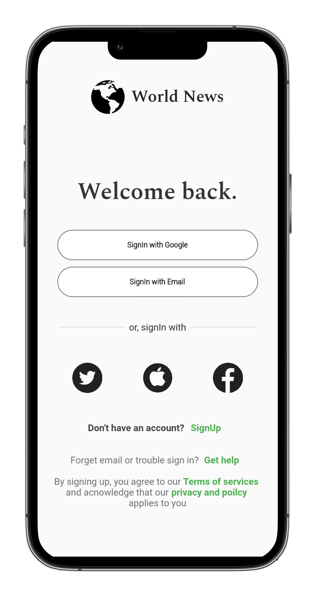
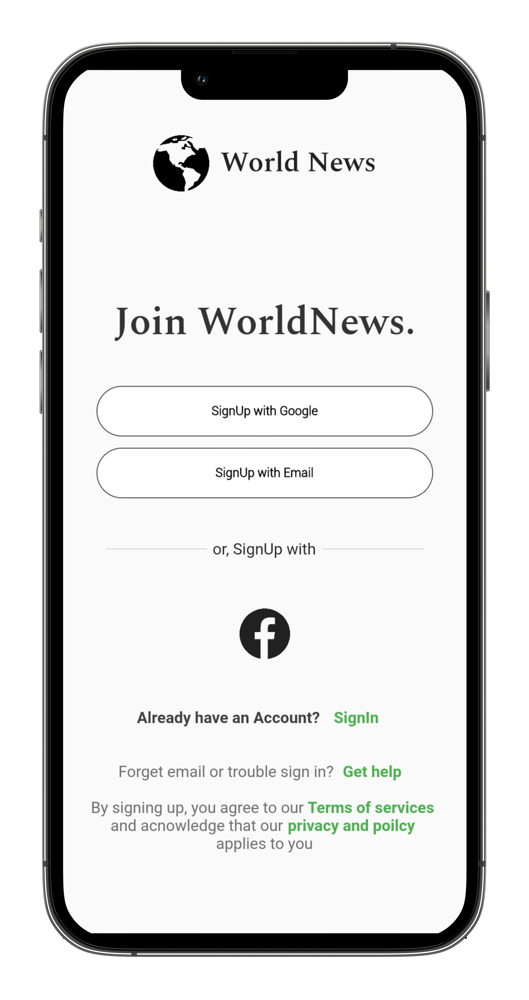
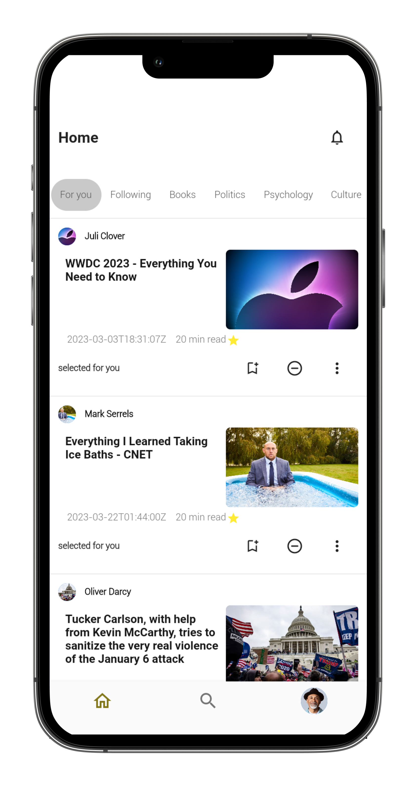
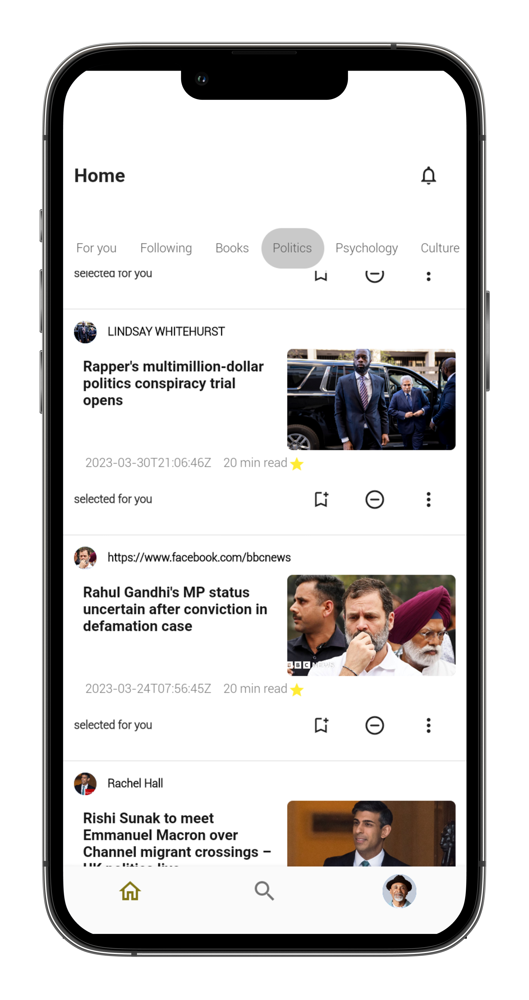
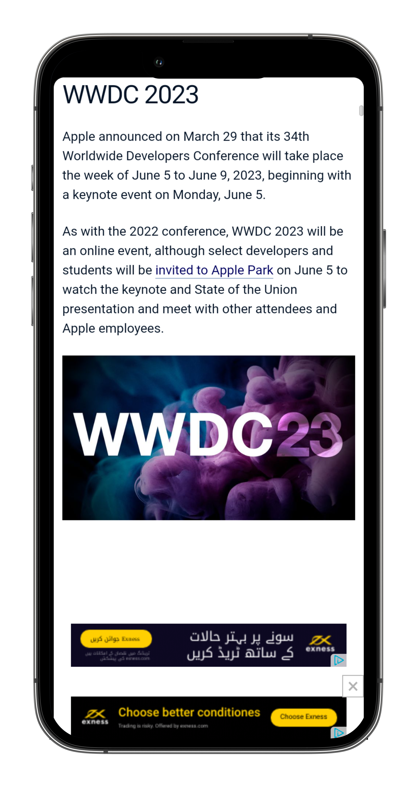
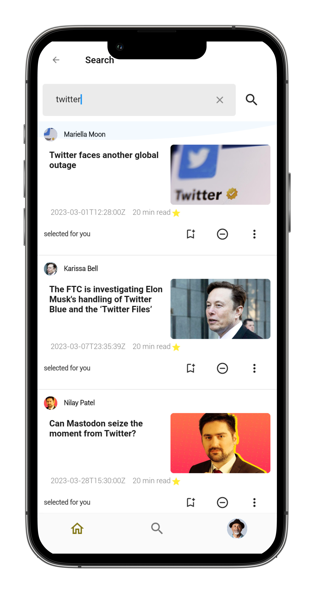
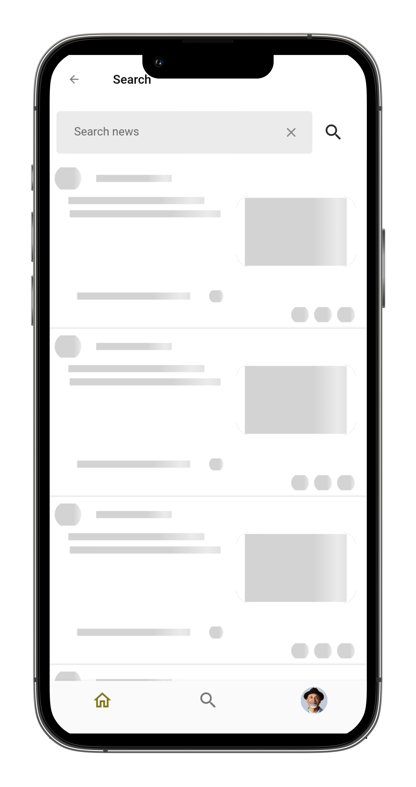
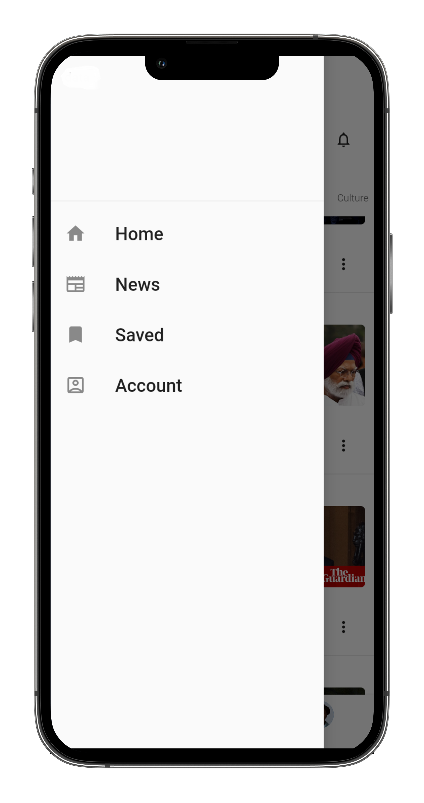
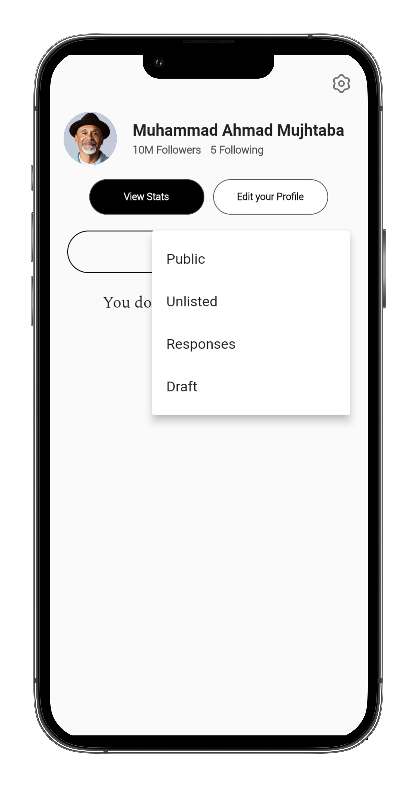
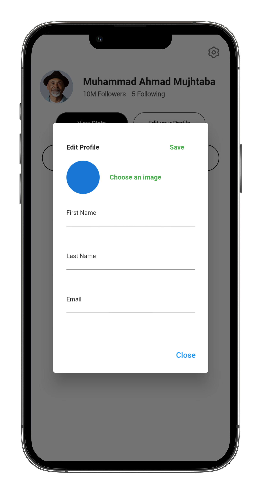

# Medium Clone App

Welcome to the **Medium Clone App**! This project is a feature-rich clone of the famous blogging platform Medium, built using Flutter. The app aims to replicate the core functionalities of Medium, providing a seamless and intuitive user experience for both readers and writers.

## Features

- **Personalized Feeds**: Curated list of articles based on user preferences.
- **Reading Experience**: Clean and distraction-free article reading interface.
- **Profile Management**: Customize your profile, view your articles, and manage drafts.
- **Search & Explore**: Find articles by tags, keywords, or author.

## Demo Video
https://user-images.githubusercontent.com/75681588/232289509-e2093b3a-f959-44d7-abca-18bf1a116e11.mp4

## Screenshots

    
    
  
  
  
  
  
  
  
  
  
  
 
  

